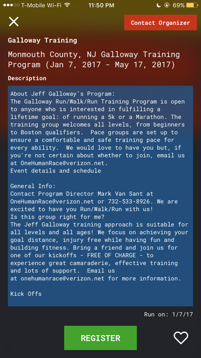

# huff

**All keys have been deactivated for the sake of security.**

huff is a simply a running app that focuses on getting a user to run in a community. The app has several features that enables the user to take actions such as register for 5K events. In order to run the app, you'll need the following:

        1. Twitter Consumer Key and Secret
        2. Twitter Account to post a tweet with #huffrunapp 
        3. An Active.com search API Key 
        4. A Google Firebase server with its plist file
        5. The values from Facebook Login SDK for info.plist




        
## Table of contents
* Instructions
* Features
* Copyright and License
        
## Instructions
To get started, make sure you have the latest dependencies installed for the project. To do that run the following command in the directory containing the podfile:

```bash
pod update
```

## Features
The app has several features which includes the following:
    * Run Tracking
    * Post a tweet with #huffrunapp and it'll appear on the twitter feed tab
    * Check out 5K events around the users location
    * Save the interesting 5K events 
    * A global distance table that is updated everytime the user opens the app
    
## Copyright and License
The code released under the [MIT License](https://github.com/rluftw/huff/blob/master/license.txt). Credit has been provided to their respective owners in app.

